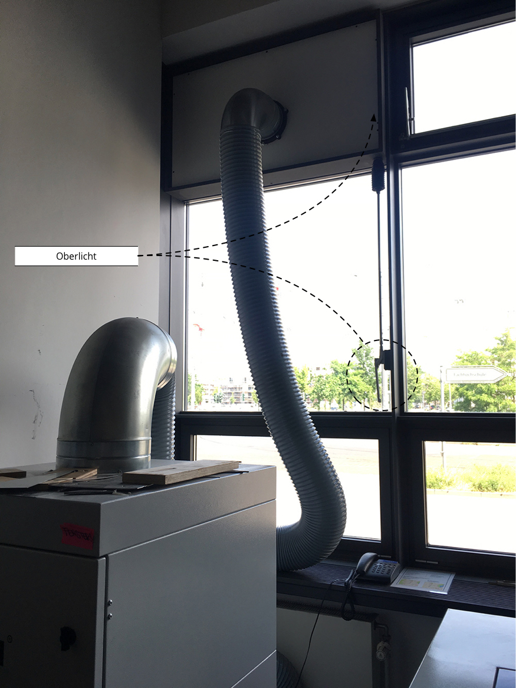
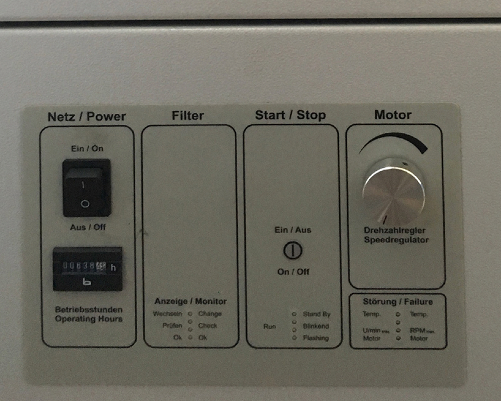
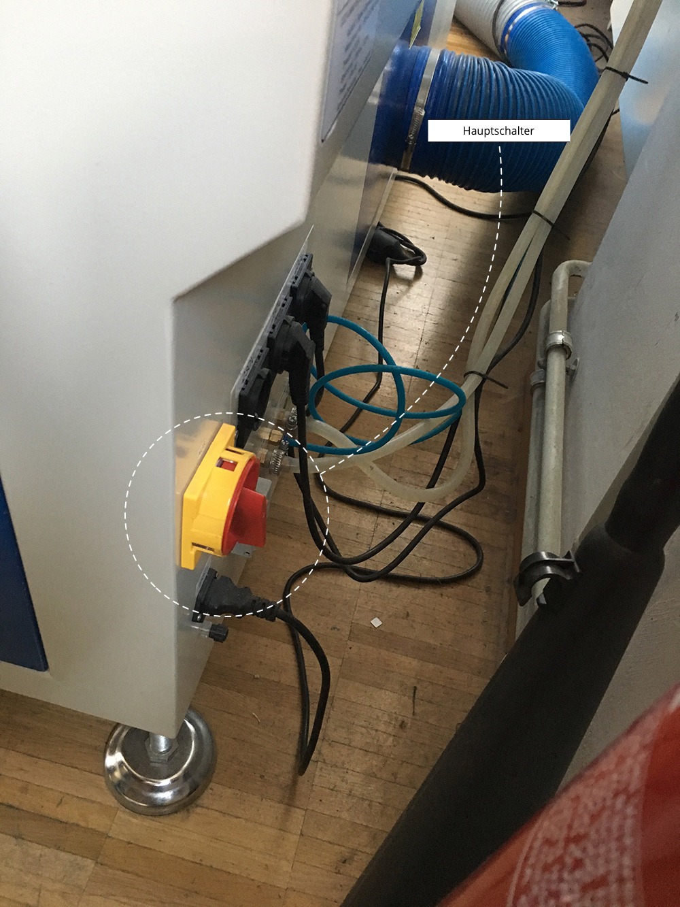
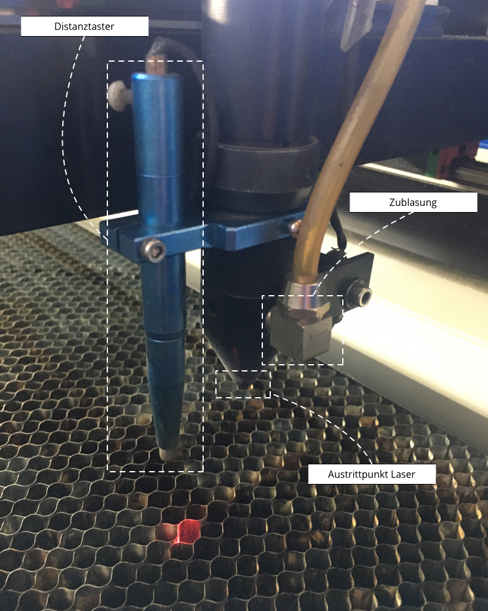
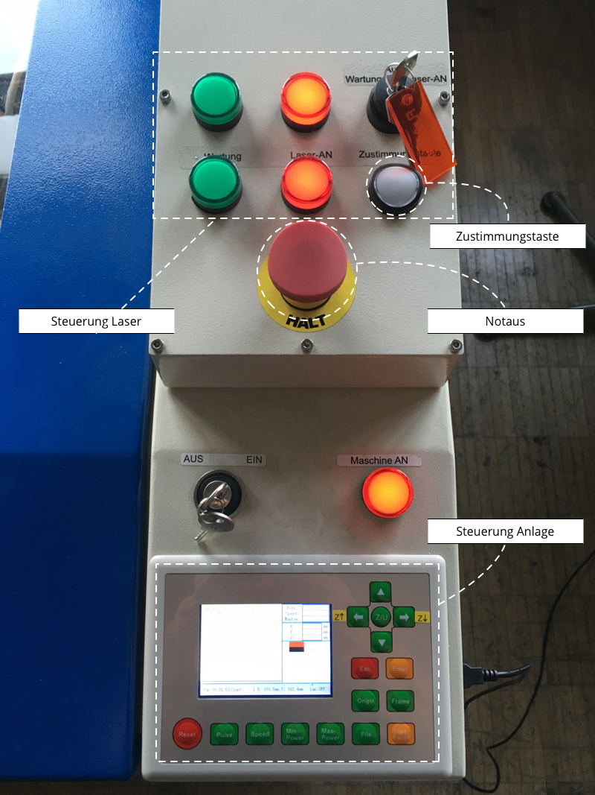
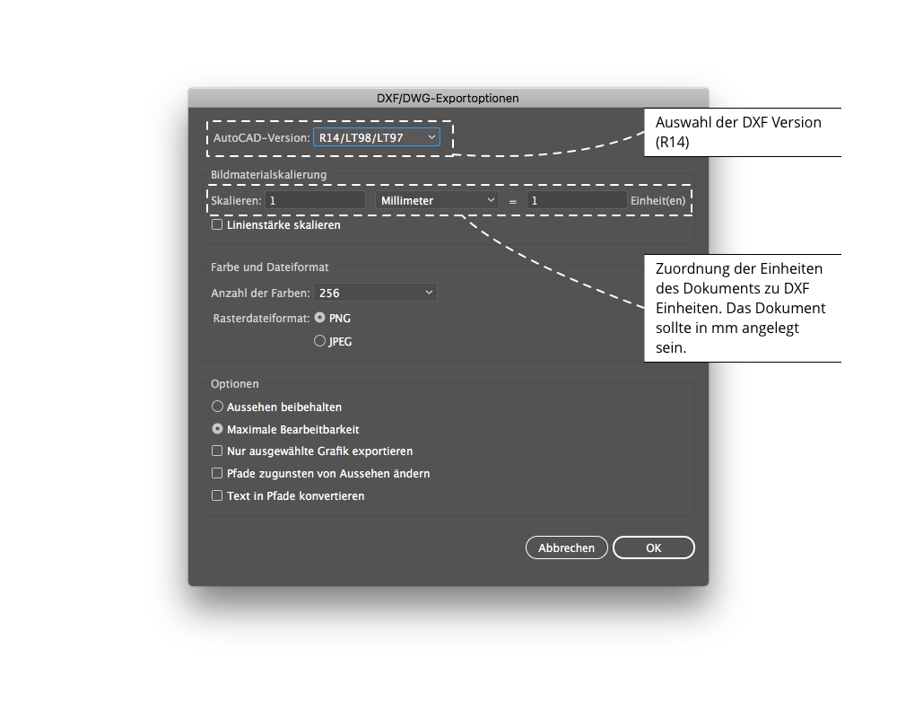
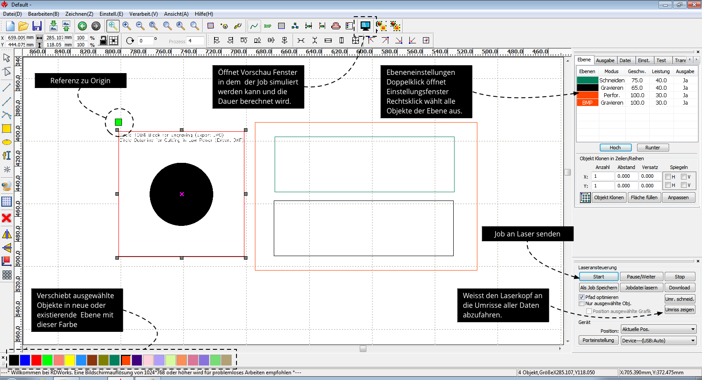
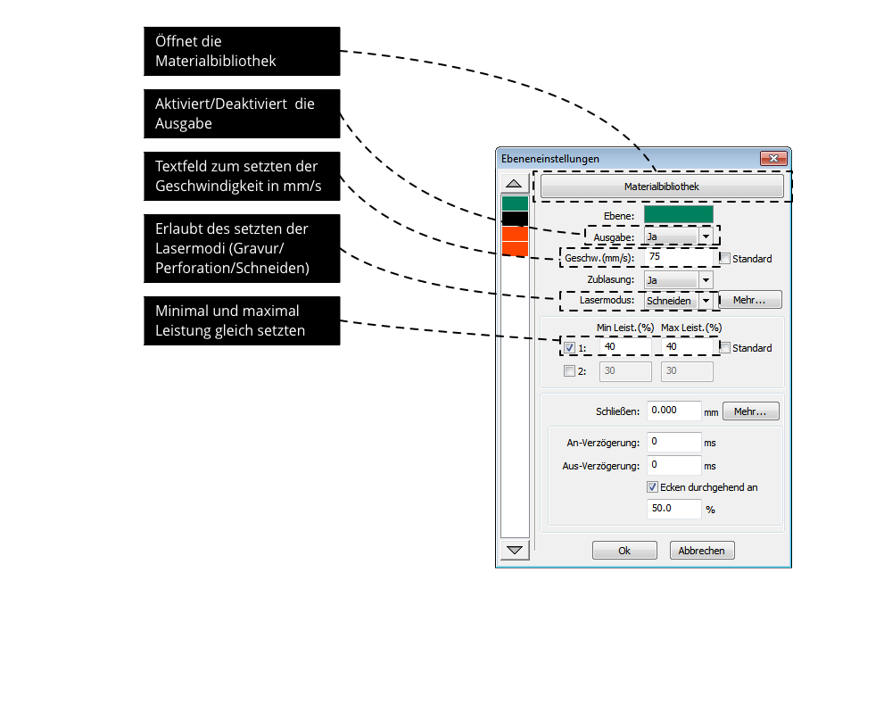
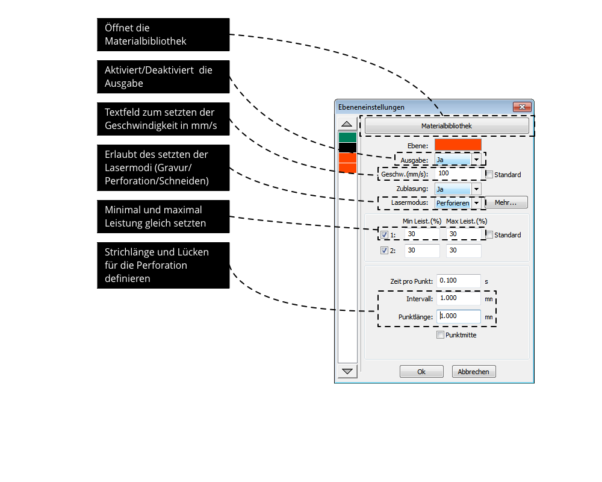

# Einleitung

{#fig:splash}  

Dieses Dokument ist der Versuch, den gesamten Prozess der Bedienung der Laser Anlage an der Fachhochschule Potsdam zu dokumentieren. Es sollte aufmerksam gelesen werden, bevor die Anlage durch Studierende in betrieb genommen wird. Am Ende des Dokuments befindet sich eine [Checkliste](#checklist), die ausgedruckt und als Spickzettel beim Betrieb verwendet werden kann. In einigen Bereichen wie der Aufbereitung von Daten und der Bedienung der Software geht es nicht in die Tiefe. Wir hoffen, dass dies als ein "lebendes" Dokument genutzt wird und zukünftig, um nützliche Bereiche erweitert wird. Anregungen, Fragen, Fehler können auf [GitHub als Issue](https://github.com/FH-Potsdam/the-ultimate-laser-guide/issues) vorgebracht werden oder per Mail an die Autoren gesendet werden. Das Dokument selber kann als PDF [hier](https://github.com/FH-Potsdam/the-ultimate-laser-guide/raw/master/The-Ultimate-Laser-Guide.pdf) runtergeladen werden. Eine HTML-Version ist [hier](https://fh-potsdam.github.io/the-ultimate-laser-guide/) zu finden. Wir freuen uns über jede Art von Beitrag. Gerne nehmen wir auch weitere Kapitel an (siehe Abschnitt [Über dieses Dokument](#über-dieses-dokument))

Viel Spaß mit dem "Ultimativen Laser Handbuch"[^ulg]!

## Grundlegende Voraussetzungen sind... 

- Die Unterzeichnung und Anerkennung der Werkstattordnung.
- Die Teilnahme an der Sicherheitseinweisung durch Anne Boenisch und oder eine Freigabe durch sie.
- Der Laser wird immer in Gruppen von 2 oder mehr Personen betrieben.  
- Der Laser wird nicht alleine gelassen, während er läuft.  
- Die Werkstatt wird nach Nutzung wieder aufgeräumt.  
- Der Laser wird nach Gebrauch gereinigt.  
- Es dürfen **KEINE** PVC-haltigen oder leicht entflammbare Materialien geschnitten werden (siehe Abschnitt [Materialien](#materialien)).  

## Sicherheit  

Die Anlage darf nicht alleine betrieben werden. Es müssen immer mindestens 2 Personen vor Ort sein.  

### Feuer?  

Im Falle eines Feuers in der Anlage gilt es Ruhe zu bewahren. Folgende Schritte sind auszuführen.

1. Laservorgang stoppen! (Notaus oder `Start/Stop` Knopf)
2. Lüftung abschalten!
3. CO2 Feuerlöscher benutzen! (Falls es immer noch brennen sollte)
4. Die Feuerwehr rufen, wenn der Brand nicht zu löschen ist!

**Hinweise:**  

- Es sollte bis zum Einsatz des Feuerlöscher die Abdeckung nicht geöffnet werden.  
- Es sollten niemals Flüssigkeiten verwendet werden, um den Brand zu löschen. 

### Notaus?  

Der Notaus (siehe +@fig:steuerung) ist für den Notfall. Wenn dieser gedrückt wurde, sollte genau überlegt werden, ob die Anlage wieder in Betrieb genommen werden kann, ohne sie zu beschädigen. Im Zweifelsfalle sind die Administratoren zu kontaktieren. Wenn der Notaus gedrückt wurde und wieder raus gezogen wird, startet die gesamte Anlage neu.[^notauseinaus] Der Laserkopf führt eine Referenzfahrt aus. Es gilt vorab darauf zu achten, dass der Kopf bei dieser Fahrt nicht beschädigt wird.  

## Pflege der Anlage

> Eine verschmutzte Maschine ist bald eine defekte Maschine.  
> – Fabian Morón Zirfas

Damit der Laser lange betrieben werden kann, muss er regelmäßig gereinigt werden. Dies passiert durch die Studierenden. Sie sind selber dazu angehalten dies zu organisieren. Nach jedem Gebrauch muss der Innenraum der Anlage ausgesaugt werden und etwaige Reste müssen entfernt werden. Ebenfalls muss der Taster gereinigt werden. Die Reinigung wird nur bei ausgeschalteter Anlage durchgeführt.

In der Metallwerkstatt stehen hinter der Tür zwei Kisten. In der einen gibt es saubere Tücher. Diese dürfen verwendet werden, um den Laser sauber zu machen.  

### Wechseln der Filter

to be defined…

### Reinigung der Spiegel

{#fig:spiegel}  

Zur Reinigung der Spiegel (siehe +@fig:spiegel) darf nur Isopropanol und Q-Tip verwendet werden. Dies sollte mindestens einmal im Monat durchgeführt werden, um eine konstante Leistung des Lasers zu garantieren.  

### Reinigung der Sichtscheiben

Zur Reinigung der Sichtscheiben darf kein alkoholhaltiges Mittel benutzen werden. Normale Lappen oder Papiertücher zerkratzen die Scheibe schnell und stark. Die Scheibe ist aus PolyCarbonat und kann somit auch nicht so leicht wieder aufpoliert werden wie zum Beispiel Acrylglas. Daher sollten zur Reiniung nur mit Wasser befeuchtete Microfasertücher genutzt werden.  

### Reinigung des Arbeitsraums

{#fig:saugmobil}

Der Arbeitsraum und auch die unteren Bereiche der Anlage müssen regelmäßig gereinigt werden. Für eine oberflächliche Reinigung kann das "Festo CTM 48 E Saugmobil" der Modellbauwerkstatt genutzt werden, um die Anlage auszusaugen (siehe +@fig:saugmobil). Es sollte jedoch auch regelmäßig mit einem Lappen eine tiefer gehende Reinigung vorgenommen werden. Auch unterhalb des Gitters und der Lamellen sowie im unteren Raum des Lasers.[^dreikant]

### Reinigung des Distanztasters

Vor jedem Gebrach muss überprüft werden, ob der Taster sich bewegen lässt. Nach jedem Gebrauch sollte der Taster mit einem Papiertuch von Ruß befreit werden.  

### Reinigung des Gitters

Das Gitter, dass im Arbeitsraum der Anlage liegt, sollte regelmäßig gereinigt werden. Wenn es zu sehr verschmutzt ist, werden Rußreste, die auf dem Gitter sind, durch den Laser nochmals entzündet. Diese schmauchen auf die Unterseite des Materials und hinterlassen unschöne Spuren. Daher ist es auch Sinne der Studierenden die Reinigung regelmäßig durchzuführen, um bestmögliche Ergebnisse zu erzielen.  

Um das Gitter zu reinigen sollte, die Wanne der Siebdruckwerkstatt und deren Kärcher genutzt werden.[^sdw]  

### Entsorgung der Schnittreste

{#fig:schnitt-reste}  

Für Schnittreste existiert ein eigener Abfallbehälter (siehe +@fig:schnitt-reste). Dieser muss selbständig und regelmäßig entleert werden.  

## Inbetriebnahme

Die folgenden Punkte **müssen** in der angegebenen Reihenfolge ausgeführt werden. *Die [Checkliste](#checklist) sollte von ungeübten Nutzer/innen zu Rate gezogen werden.*  

### Oberlicht Öffnen

{#fig:oberlicht}  

Damit eine arbeitsgerechte Abluft stattfinden kann, muss das Oberlicht an das die Lüftung angeschlossen ist, geöffnet werden (siehe +@fig:oberlicht).  

### Lüftung Einschalten

{#fig:luefter width=50%}  

An der Lüftung gibt es den 4 Steuerungsbereiche (siehe +@fig:luefter).

1. Netz/Power
2. Filter
3. Start/Stop
4. Motor

Über den Hauptschalter in Bereich 1 wird die Lüftung aktiviert. Wenn im Bereich 2 die Status-LED OK (grün) anzeigt, kann die Maschine in Betrieb genommen werden. Steht sie auf Prüfen oder Wechseln müssen zuallererst die zuständigen Personen kontaktiert werden. Die Anlage wird bis dahin **nicht** in Betrieb genommen.  

Über den `Start/Stop` Knopf in Bereich 3 kann die Lüftung pausiert werden.  

In Bereich 4 kann die Stärke der Lüftung angepasst werden. Bei stark rußenden Materialien sollte die Lüftung auch stark belüften.  

Um die Ohren zu schonen, kann der Motor der Lüftung in Bereich 4 runter gedreht  oder in Bereich 3 pausiert werden, solange kein Job läuft. *Dies darf jedoch nicht vergessen werden wieder zu aktivieren.*  

### Arbeitsfläche leeren

Damit der Laserkopf bei der ersten Referenzfahrt in die rechte Obere Ecke nicht beschädigt wird, darf kein Material bei der Inbetriebnahme auf der Arbeitsfläche liegen.  

### Gitter Überprüfen  

Das Gitter, dass in der Maschine liegt ist frei beweglich. Es muss vor der Inbetriebnahme sichergestellt werden, dass es nicht unter die Absätze links und rechts rutschen kann. Bei einem Autofokus oder fahren der Z-Achse könnte sonst die Ausrichtung der Plattform beschädigt werden. Diese muss dann manuell wieder in Waage gebracht werden.  

### Hauptstrom  

{#fig:hauptschalter}  

Auf der Rückseite des Lasers ist ein großer rot gelber Hauptschalter (siehe +@fig:hauptschalter). Dieser muss aktiviert werden, um der Maschine Strom zu geben.  

### Distanztaster Überprüfung

{#fig:laserkopf}  

Am Laserkopf ist links der Distanztaster (siehe +@fig:laserkopf).[^taster] Dieser dient dazu die Distanz des Lasers zur Oberfläche des Materials einzustellen.[^distanz] Vor dem Einschalten der Lasersteuerung muss überprüft werden:  

1. Ob der Taster sich bewegt.[^tasterfrei]
2. Ob der Taster über dem Gitter beziehungsweise den Lamellen steht und nirgendwo anstoßen kann bei einer Referenzfahrt.

### Einschalten  

{#fig:steuerung}  

Wenn alle entsprechenden Überprüfungen stattgefunden haben, kann die Maschine über den `Aus/Ein` Drehschalter mit dem Schlüssel aktiviert werden (siehe +@fig:steuerung unten). **Hierbei ist die eine Hand über dem Notaus**, für den Fall, dass etwas unvorhergesehenes passiert.[^reffahrt]  

#### Referenzfahrt  

Bei jedem Einschalten (oder nach einem [Notaus](#notaus)) führt die Maschine eine Referenzfahrt in die rechte obere Ecke aus. Dies lässt sich nicht unterbinden. Aus diesem Grund ist es besonders wichtig, beim Einschalten die Maschine im Falle eines Problems schnell wieder abschalten zu können. Um Probleme zu vermeiden, ist es "Best Practice" den Laserkopf vor dem Abschalten in die rechte obere Ecke zu fahren und dort den "`Origin`" zu setzten. Dadurch können Probleme beim nächsten Anschalten des Anlage vermieden werden. Ebenfalls empfiehlt es sich, die Z-Achse ein Stück abzusenken. Siehe Abschnitt "Gitter Überprüfen".  

### Z-Achse  

{#fig:menu}  

{#fig:zachse}  

Die Z-Achse des Tisches kann manuell herauf oder hinunter gefahren werden. Wenn zum Beispiel ein dickes Material eingelegt werden soll. Dazu muss an der Steuerung (siehe +@fig:zachse) das Menü mit dem `Z/U` (siehe +@fig:menu) Knopf in der Mitte des Steuerkreuzes aktiviert werden. Dann können die `←` und `→` Tasten genutzt werden um mit `←` die Z-Achse rauf zu fahren und mit `→` runter zu fahren. Ebenfalls kann das Gitterrost herausgenommen werden, um noch mehr Tiefe zu erzeugen.  

### Material Einlegen  

Wenn die Maschine betriebsbereit ist, kann das zu schneidende Material eingelegt werden. Die Arbeitsfläche der Anlage hat 1200 Millimeter (mm) Breite und 900mm Höhe. Abhängig von der Tiefe/Stärke des Materials ist jedoch die Fläche nicht komplett nutzbar.  

Ein Beispiel: Beim Lasern einer diagonale  über eine 5 × 1000 × 700mm (t × b × h) mitteldichten Faserplatte (MDF Platte) mit einer Geschwindigkeit von 5mm/s und einer Leistung von 95% ist der Laserstrahl bei ungefähr der Hälfte des Materials nicht mehr durchgegangen.  

Das bedeutet: Je stärker das Material desto kleiner wird der Bereich in dem ein Schnitt gewährleistet ist. Es empfiehlt sich bei starken Materialien kleinere Nutzen anzulegen und mehrere Jobs auszuführen.  

### Fokus Setzen  

{#fig:autofokus}  

Um den Laserkopf in seiner Distanz zur Oberfläche des Materials einzustellen, hat die Maschine eine Autofokus Funktion. Dazu wird der Distanztaster[^taster] \(siehe +@fig:laserkopf\) mit dem Steuerkreuz in die Mitte des Materials gefahren.  

**Achtung:** Es empfiehlt sich bei geöffneter Klappe zu fokussieren. Ein üblicher Fehler, den es jedoch zu vermeiden gilt, ist dass nicht der Taster über das Material gesetzt wird sondern der Laserpunkt. Das könnte zur Folge haben, dass der Distanztaster im Gitter versenkt wird.[^fuckuptaster] 
Gegebenenfalls muss die Z-Achse noch runter gefahren werden, wenn dies nicht schon beim Einlegen des Materials passiert ist (siehe Abschnitt [Z-Achse](#z-achse)). Ebenfalls sollte drauf geachtet werden, dass das Werkstück nicht kippen kann.  
Wenn das Material unter dem Taster liegt, kann das Menü über die Z/U Taste aktiviert werden (siehe +@fig:menu). Mit dem Punkt `Autofocus` (siehe +@fig:autofokus) wird die Distanz automatisch auf 21,2mm eingestellt. Über die  `↑ ↓` Tasten kann der Punkt Autofocus ausgewählt werden. Mit `Enter` wird er aktiviert.  

**Achtung:** Beim Einstellen des Autofokus sollte immer ein Finger auf dem `Esc` (Escape) Knopf liegen, für den Fall, dass etwas unvorhergesehenes passiert (Der Taster bohrt sich durch das Material, der Taster reagiert nicht, der Taster ist doch nicht über dem Material).  

Nach dem Autofokus Prozess liegt der Brennpunkt des Lasers auf der Oberfläche des Materials.[^hackfokus] 

### Null Null (`Origin`)

{#fig:origin}  

Um die Maschine für den Laser Job bereits zu haben, kann nun der Laserkopf mit den `← ↑ ↓ →` Tasten an die gewünschte Position gefahren werden. Um diese Position als Ausgangspunkt für einen Schnitt, eine Gravur oder eine Perforation zu setzten, muss dies mit der Taste "`Origin`" (siehe +@fig:origin) bestätigt werden.[^origin] Falls Unsicherheit besteht ob der `Origin` auch der aktuellen Position des Laserkopfes entspricht, kann über einen Druck auf die Taste `Esc` der Kopf auf seinen letzten `Origin` zurückgesetzt werden.  

**Achtung:** Vor dem Starten eines Jobs sollte nochmals sichergestellt werden, dass der `Origin` stimmt. Der Laser beginnt einen Job von dieser Position aus (siehe Abschnitt [Positionierung](#positionierung)). Falls die Position vom `Origin` abweicht, könnte das Material an einer anderen Stelle bearbeitet werden.  

## Laser Job  

Die einfachste Methode einen Job zu starten ist, über die USB Verbindung aus der RDWorks Software heraus mit der Start Taste. Es existiert auch die Möglichkeit Job Dateien aus RDWorks heraus auf ein USB Stick zu speichern und diesen direkt in die Maschine zu stecken. Dafür muss der Stick FAT formatiert sein und die Dateien müssen auf der untersten Ebene des Dateisystems liegen. Unterordner werden nicht erkannt. Im weiteren Verlauf dieses Handbuches wird diese Möglichkeit nicht berücksichtigt. Ebenfalls werden hier nur die minimalen Schritte beschrieben um einen Job mit RDWorks einzurichten und      auszuführen. Ein komplette Übersicht würde den Rahmen diese Dokuments sprengen. Hierfür existiert ein Benutzerhandbuch, das vom Hersteller der Software zusammen mit dieser ausgeliefert wird.  

### Positionierung  

Der [Origin](#null-null-origin) des Laserkopfes korrespondiert mit der linken oberen Ecke der Daten in der Software (siehe +@fig:rdsoftware). Dies sollte nicht verändert werden, da die Leistung des Lasers von Links oben nach rechts unten abnimmt.[^schnittleistung] Wenn die Daten die mögliche zu fahrende Fläche überschreitet, wird dies im Menü angezeigt. Es ist möglich den Job dennoch durchführen zu lassen. Alles was über die Arbeitsfläche hinaus geht wird nicht gelasert.  

### Die Parameter Verstehen

Die Parameter die zur Verfügung stehen sind 

1. Die Geschwindigkeit des Laserkopfes gemessen in Millimeter pro Sekunde (mm/s).
2. Die Intensität des Laserstahls gemessen in Prozent (%).  

Ausgehend von diesen beiden Parametern muss der Job eingerichtet werden. Ein 3mm Acrylplatte würde zum Beispiel bei 10mm/s und 90% Leistung geschnitten werden. Eine Gravur auf dieser Platte kann schon bei 80mm/s und 15% Leistung gut aussehen.  

Stärkere Materialien bedürfen mehr Leistung und eine langsamere Bewegung. Dünne Materialien können bei einer schnellen Fahrt auch schon mit geringer Leistung geschnitten werden. Wobei eine zu hohe Geschwindigkeit sich auch auf die Qualität von Kurven und Ecken auswirkt. Es gilt hier eigenen Erfahrungswerte zu sammeln. Ebenfalls können die Außentemperatur, die Feuchtigkeit des Materials oder auch die Reinigung der Umwerf-Spiegel die Werte beeinflussen.  

### Daten Vorbereiten  

Die Steuerungssoftware RDWorks kann mit zwei unterschiedlichen Dateitypen umgehen.

1. Vektor Daten
2. Pixel Bilder

### Vektor Daten  

Vektor Daten können für das Schneiden, Perforieren und Gravieren genutzt werden. Es existieren einige Applikationen zum Erstellen von Vektordaten. Adobe Illustrator (AI), [Inkscape](https://inkscape.org/en/), Affinity Designer, Sketch. Hier werden Beispiele aus AI gezeigt.  

Für Schnitt und Perforation können Pfade angelegt werden, die offen sind. Diese werden von dem Laserkopf nachgefahren. Hierbei ist zu beachten, dass die Software jeden Pfad erkennt, der im Dokument liegt. Es werden nur Pfade erkannt, keine Konturen. In +@fig:ai-kontur ist die GPU-Vorschau von AI zu sehen. Dies ist jedoch nicht, was der Laser erkennt.

{#fig:ai-kontur}

Was in +@fig:ai-pfad zu sehen ist, entspricht dem, was von dem Laserkopf nach fahren würde. Die Abbildung zeigt die Pfadansicht. Um zwischen GPU-Vorschau und Pfadansicht zu wechseln kann die Tastenkombination `Command Y` (macOS) oder `Strg Y` (Win) genutzt werden.[^keys]  

{#fig:ai-pfad}  

Für die Gravuren funktionieren nur geschlossene Vektorpfade. In +@fig:offengpu sieht es so aus, als ob beide Flächen geschlossen sind. Die Pfadansicht zeigt jedoch, dass die rechte Form nicht geschlossen ist +@fig:offen. Somit würde die rechte Form für eine Gravur nicht beachtet werden.  

{#fig:offengpu}  

{#fig:offen}  

\newpage 

Grundsätzlich sollte ein AI Dokument so angelegt werden, dass

- keine Überreste von Pfadpunkten in ihm liegen.
- keine Ebenen ausgeblendet werden.
- keine Daten außerhalb der Arbeitsfläche liegen.  

{#fig:reste-gpu}  

{#fig:reste}  

In +@fig:reste-gpu und +@fig:reste sind in der Pfadansicht Reste zu sehen, die optisch in der GPU-Vorschau nicht zu erkennen wären. Die Maschine würde diese Pfadpunkte und Pfade dennoch in Betracht ziehen.  

#### Unterstützte Vektor Formate

Die Software RDworks unterstützt viele Formate. Die besten Ergebnisse wurden bisher mit folgenden Formaten erzielt.[^formate]  

- .ai (Version 3)
- .dxf (R14)

Bei allen Formaten ist zu beachten, dass die voreingestellte Einheit mm sein sollte. 

#### Limitierungen von Vektorformaten

Wenn man die Pfade durch Code generiert ([Processing](https://processing.org/), [p5js](https://p5js.org/), etc.), muss man auf die Länge der Pfade (Anzahl Punkte) achten. Sowohl Programme wie Illustrator als auch RD_Works selber haben hier Limits. Bei beiden Programmen ist nicht wirklich dokumentiert, was diese Limits sind. Hier muss man darauf achten entweder die Anzahl Punkte reduzieren, oder die Pfade in mehrere Unterpfade aufbrechen.

#### AI DXF Export

{#fig:ai-datei-dialog}  

DXF Dateien können aus AI unter `Datei>Exportieren>Exportieren als…` ausgegeben werden. Dazu muss am unteren Rand des Datei Dialogs die Option `AutoCAD-Interchange-Format (DXF)` gewählt werden. Siehe +@fig:ai-datei-dialog.  
Dies öffnet einen weiteren Dialog für die Einstellungen der DXF Datei. Hier ist drauf zu achten, dass

- die AutoCAD Version `R14/LT98/LT97` ist.
- im Abschnitt `Bildmaterialskalierung` die Einheiten richtig von 1 mm in 1 Einheit skaliert werden.

Alle weiteren Einstellungen können so bleiben, wie sie sind. (Siehe +@fig:dxf-ex)

{#fig:dxf-ex}  

##### Daten Trennen

Wenn in einer Datei mehrere Arten von Schnitt, Perforation oder Gravur angelegt werden sollen, können die einzelnen Objekte getrennt werden, indem ihnen eine eigene Farbe zugeordnet wird. Ebenen werden beim Export nicht berücksichtigt.   

### Pixelbilder  

Es können ebenfalls Pixelbilder genutzt werden, um Gravuren zu erzeugen. Hierbei besteht die Möglichkeit die Graustufen des Bildes zu verwenden, um die Intensität des Lasers zu steuern. Die Bilder können maximal einen Auflösung von 1000 "dots per inch" (dpi) haben. Ab 300dpi können bereits sehr gute Ergebnisse erzielt werden. Unterhalb von 300dpi wird die Auflösung der Gravur roh. Gerade bei Schriften sollte wenn möglich entweder eine hohe Auflösung genutzt werden oder auf Vektoren zurückgegriffen werden.

#### Limitierungen bei Pixelbildern

Auch wenn eine Auflösung von 1000 dpi möglich ist, gibt es ein Limit bei der Größe der Bilder, welche bei ca. 7500x7500 Pixeln liegt.

{#fig:moire} 

Wenn die Rasterbilde sehr viele Linien oder Punkte enthalten, also abwechseln dunkle und helle Pixel, kann es zu einem [Moiré-Effekt](https://de.wikipedia.org/wiki/Moir%C3%A9-Effekt) kommen (siehe +@fig:moire). Zumindest nach aktuellem Erfahrungsstand lässt sich dies nicht umgehen. Bei feinen Details die auch über Laserschnitt erstellt werden können, gibt es aber eine Lösung: Im Menü über *Handling > Bitmap Handling* das Fenster für Bitmap-Bearbeitung aufrufen. Dort Pfade generieren (Get Outline) lassen und diese der Quelle und dem Display (Apply to view, Apply to source) zuweisen. Dies vektorisiert das Bitmap. Dabei ist zu beachten, das aus Linien Flächen werden. Wenn es sehr dünne Linien sind, ist das egal, ABER der Laser fährt dann zweimal über jede Linie, dies sollte entsprechend bei der Stärke beachtet werden.

### Daten Import

Vektor Dateien und Pixelbilder werden über den Befehl `Datei>Import` in die Software eingeladen.  

### Art des Jobs

Die Art des Laserjobs bestimmt auch mit welche Möglichkeiten zur Verfügung stehen.  

- Schneiden
- Gravieren
- Perforieren

{#fig:rdsoftware}  

\newpage 

#### Schneiden  

Um einen Schnitt einzurichten, kann mit einem Doppelklick auf die entsprechende Ebene in der Ebenenpalette rechts oben (siehe +@fig:rdsoftware) das Menü für die Einstellungen aufgerufen werden. Siehe +@fig:rdcut. Hier kann eingestellt werden, wie schnell der Laserkopf gefahren werden soll und mit welcher Intensität der Schnitt stattfinden soll. Dazu muss:  

1. Die `Ausgabe` auf `Ja` stehen.
2. In `Geschw.(mm/s)` der gewünschte Wert eingetragen werden.
3. Der `Lasermodus` auf `Schneiden` stehen.
4. Im Feld mit der 1 und der Checkbox in `Min Leist (%)` und `Max Leist. (%)` der gleiche Wert eingetragen werden.[^leistung]

Alle weiteren Möglichkeiten sind zur Feineinstellung. Hierfür sollte das Handbuch der Software zu Rate gezogen werden.  

{#fig:rdcut}

#### Gravieren  

Um eine Gravur einzurichten, kann mit einem Doppelklick auf die entsprechende Ebene in der Ebenenpalette rechts oben (siehe +@fig:rdsoftware) das Menü für die Einstellungen aufgerufen werden. Siehe +@fig:rdgrav1. Hier können verschieden Parameter der Gravur definiert werden. Dazu muss:  

1. Die `Ausgabe` auf `Ja` stehen.
2. In `Geschw.(mm/s)` der gewünschte Wert eingetragen werden.
3. Der `Lasermodus` auf `Gravur/Scan` stehen.
4. Das Feld `Graustufen ausgeb` gewählt sein oder nicht (siehe +@fig:rdgrav2).[^graustufen]
5. Die Leistung eingestellt werden
    1. Wenn einheitlich graviert werden soll, muss im Feld mit der 1 und der Checkbox in `Min Leist (%)` und `Max Leist. (%)` der gleiche Wert eingetragen werden.[^leistung]. In diesem Fall sollte Graustufen ausgeben nicht gewählt sein.
    2. Wenn abhängig von den Graustufen des Bildes graviert werden soll. muss im Feld mit der 1 und der Checkbox in `Min Leist (%)` die Leistung für das schwächste Grau eingetragen werden und im Feld `Max Leist. (%)` die Leistung für das tiefste Schwarz eingetragen werden.[^minleistung]
6. Für den `Gravurmodus` gewählt werden ob[^gravurmodus]
    1. X nur in eine Richtung graviert werden soll.
    2. X in beide Richtungen graviert werden soll.
    3. Y nur in eine Richtung graviert werden soll.
    4. Y in beide Richtungen graviert werden soll.
7. In `Zeilenabst. (mm)` der Abstand zwischen den einzelnen Gravurzeilen eingegeben werden. Der Standard ist 0,1mm. Dies kann aber noch weiter reduziert werden.  

Alle weiteren Möglichkeiten sind zur Feineinstellung. Hierfür sollte das Handbuch der Software zu Rate gezogen werden.  

{#fig:rdgrav1}  

{#fig:rdgrav2}  

#### Perforieren

Um eine Perforation einzurichten kann mit einem Doppelklick auf die entsprechende Ebene in der Ebenenpalette rechts oben (siehe +@fig:rdsoftware) das Menü für die Einstellungen aufgerufen werden. Siehe +@fig:rdperf. Hier kann eingestellt werden wie schnell der Laserkopf gefahren werden soll, mit welcher Intensität die Perforation stattfinden soll und wie das Verhältnis zwischen Schnitt – Lücke – Schnitt – Lücke – etc. sein soll. Dazu muss:  

1. Die `Ausgabe` auf `Ja` stehen.
2. In `Geschw.(mm/s)` der gewünschte Wert eingetragen werden.
3. Der `Lasermodus` auf `Schneiden` stehen.
4. Im Feld mit der 1 und der Checkbox in `Min Leist (%)` und `Max Leist. (%)` der gleiche Wert eingetragen werden.[^leistung]
5. Das `Interval` auf einen mm Wert definiert werden.
6. Die `Punktlänge` auf einen mm Wert definiert werden.

Alle weiteren Möglichkeiten sind zur Feineinstellung. Hierfür sollte das Handbuch der Software zu Rate gezogen werden.  

{#fig:rdperf}

### Material Bibliothek  

Bei allen drei Arten von Jobs ist die Einstellung von Leistung und Geschwindigkeit abhängig von dem Material. Glücklicherweise bietet die Software bietet die Möglichkeit Einstellungen zu speichern. Diese können in der Materialbibliothek abgelegt werden. Um diese zu öffnen muss mit einem Doppelklick erst die Einstellung der Ebenen geöffnet werden. Im oberen Bereich befindet sich ein Knopf (siehe zum Beispiel +@fig:rdperf) für die Materialbibliothek (siehe +@fig:rdbib). Von dort aus können Einstellungen geladen oder die aktuellen unter einem neuen Namen gespeichert werden.[^bibsave] Hierbei ist es ratsam einen aussagekräftigen Namen zu wählen. Als Standard sollte folgendes Muster gelten.  

    Material Stärke Jobtyp

Dies würde bei einer Gravur auf einer 3mm Hochdichte Faserplatte (HDF) zu `HDF 3mm Gravur` werden.   

{#fig:rdbib}  

### Lüftung  

**Achtung:** Das Aktivieren der Lüftung darf nicht vergessen werden.

### Den Job Starten  

Wenn der Job in RDWorks soweit eingerichtet ist, wird es Zeit ihn zu starten. Vorher sollte noch folgende Punkte ein letztes mal überprüft werden.  

1. Ist der Fokus richtig gesetzt?
2. Steht der Laserkopf auf dem `Origin` (Null/Null) und ist der `Origin` richtig?
3. Ist die Lüftung aktiviert?
4. Ist die Abdeckung des Lasers geschlossen?
5. Passen die Daten auf das eingelegte Material?
6. Wurde die Zustimmungstaste gedrückt?

**Zu 1):**  

Es sollte ein letztes mal überlegt werden, ob der Fokus richtig gesetzt wurde. Im Zweifelsfall sollte dieser Arbeitsschritt nochmal ausgeführt werden.  

**Zu 2):**  

Der Laserkopf muss an seinem 0/0 Punkt stehen. Über einen Druck auf die Taste `Esc` wird der Kopf auf seinen letzten `Origin` zurückgesetzt.  

**Zu 3):**  

Die Lüftung muss aktiviert sein. Gerade bei Holz Materialien kann es zu einer starken Rauchentwicklung kommen.  

**Zu 4):**  

Die Abdeckung des Lasers muss geschlossen sein, damit der Job gestartet werden kann.  

**Zu 5):**  

Ob die Daten auf das Material passen, kann aus der Software heraus überprüft werden. Rechts unten in RDWorks (siehe +@fig:rdsoftware) gibt es die Möglichkeit, mit dem Knopf `Umriss zeigen` den Laserkopf die äußeren Kanten der Vorlage abfahren zu lassen.  

**Zu 6):**  

Die Lasersteuerung weiß nicht, ob der Laser aktiviert ist oder nicht. Daher kann ein Job gestartet werden, ohne das ein Schnitt, eine Gravur oder eine Perforation zu Stande kommt. Um den Laser zu aktivieren muss:

1. Die Abdeckung geschlossen sein.
2. Die Zustimmungstaste gedrückt werden (siehe +@fig:steuerung).

Wenn all diese Maßnahmen getroffen wurden, kann über die Schaltfläche `Start` (siehe +@fig:rdsoftware) in der Software der Job an den Laser gesendet werden.  

### Der Job Läuft

Während ein Laser Job läuft darf die Anlage nicht unbeaufsichtigt bleiben. Ebenfalls sollte die Abdeckung nicht geöffnet werden. Falls es nötig ist die Abdeckung zu öffnen, wird der Job pausiert. Falls ab dem aktuellen Punkt weiter gelasert werden soll, kann dies über die `Start/Pause` (siehe +@fig:steuerung) Taste veranlasst werden. Dabei ist drauf zu achten, dass nochmals die `Zustimmungstaste` gedrückt werden muss. Sonst fährt der Laserkopf weiter, aber der Laser wird nicht wieder aktiviert.  

## Abschaltung

Der Prozess der Abschaltung ist grundsätzlich die umgekehrte Variante der Inbetriebnahme bis auf einige Ausnahmen.  

### Laserkopf in Ausgangspostion

Da der Laser nach dem Anschalten sofort eine Referenzfahrt macht, muss vor dem Abschalten der Laserkopf in die rechte obere Ecke der Arbeitsfläche gefahren werden und dort seinen letzten `Origin` erhalten. Damit kann verhindert werden, dass die/der nächste Nutzer/in den Laserkopf beschädigt, weil Material auf der Arbeitsfläche vergessen wurde oder das Gitter dem Distanztaster im Weg ist.  

### Z-Achse Runter Fahren

Um die Inbetriebnahme weiter zu vereinfachen, sollte die Z-Achse ein Stück runter gefahren werden. Nicht so weit, dass das Gitter unter den Absatz rutschen kann. Jedoch so weit, dass optisch direkt sichtbar ist, dass der Taster nicht gegen das Gitter stoßen kann.  

### Abschaltung Steuerung und Laser 

Ist der Laserkopf in der Ausgangsposition und der `Origin` wurde gesetzt, kann mit der Laser auf `Aus` gestellt werden und die Steuerung ebenfalls (siehe +@fig:steuerung).

### Abschaltung Hauptstrom

Nach dem letzten Setzten der Ausgangsposition, der Anpassung der Z-Achse und dem Abschalten der Anlage, kann der Hauptstrom abgeschaltet werden (siehe +@fig:hauptschalter).  

### Lüftung

Jetzt kann die Lüftung in Bereich 1 (siehe +@fig:luefter) ausgeschaltet werden.

### Oberlicht Schließen

Zuletzt wird das Oberlicht, an dem die Lüftung hängt, geschlossen.   

<!--
## Steuerung
### Speed
 -->

## Materialien  

**In dem Laser dürfen keine PVC-haltigen Materialien geschnitten werden!** PVC-haltige Material erzeugen Chlorwasserstoffgase, die höchst giftig sind und auch die Maschine angreifen. Wenn es nötig ist, Polymere zu identifizieren, kann [dieses Paper](http://www.chymist.com/Polymer%20Identification.pdf) ("Identification Of Polymers") von David A. Katz ebenfalls zu Rate gezogen werden.  

Das FabLab München hat in seinem Wiki eine [umfassende Liste][fablabmuenchen] von möglichen und unmöglichen Materialien und das Wiki des [ATX Hackerspace](http://atxhackerspace.org/wiki/Laser_Cutter_Materials) ist ebenfalls eine gute Quelle.  

> **Schneidbare Materialien:**
> 
> *   Holz (bis ca. 6mm Dicke)
> *   Papier
> *   Karton/Pappe
> *   Acryl/Plexiglas (bis ca. 6mm Dicke) bzw. PMMA [(Polymethylmethacrylat)](https://de.wikipedia.org/wiki/Polymethylmethacrylat)
> *   Stoffe
> *   Leder
> *   Linoleum
> *   Pertinax
> *   Schleifpapier (von der Rückseite her)
> *   Elfenbein / Horn
> *   Seide
> *   Delrin (POM, acetal)
> *   Mylar (polyester)
> *   PETG (polyethylene terephthalate glycol)
> 
> Gravierbar sind dieselben Materialien plus:
> 
> *   lackierte Metalle
> *   Edelstahl (mit speziellem Sprüh-Lack)
> *   eloxiertes Alu
> *   Glas
> *   Stein (beschränkt)
> *   Marmor (beschränkt)
> *   Gips
> *   Fleece
> 
> **Auf keinen Fall dürfen geschnitten werden:**
> 
> *   PVC/Vinyl, Neopren und sämtliche andere chlorhaltigen Stoffe! Entwickelt giftige Dämpfe! Außerdem geht die Maschine kaputt.
> *   hoch entzündliche/explosive Materialien (versteht sich von selbst)
> *   ABS (acrylonitrile butadiene styrene) - stinkt gewaltig und erzeugt giftige Gase
> *   halogenierten Monomeren bestehende Kunststoffe wie , Vinyl, Polydibromstyrol,  (Teflon)
> *   Bakelit - Bitte nicht lasern - [siehe Link](http://www.baubegriffe.com/Bausachverstandiger_Holzmann-Bauberatung/Blog/Eintrage/2011/10/11_122_Schadstoffe_die_unser_Leben_beeinflussen.html) 
> 
> Funktioniert nicht gut, besser nicht verwenden:
> 
> *   Polykarbonat (PC, Lexan) – schlechter Schnitt, verfärbt sich, fängt Feuer
> *   High density polyethylene (HDPE) – schmilzt
> *   Polypropylene (PP) – schmilzt (dünne Folien bis 1mm OK)
> *   Polystyrol (PS) – schmilzt (dünne Platten OK)
> *   Polyethylene (PE) – schmilzt
> *   Styrodur – schmilzt
> *   Nylon – schmilzt
> *   Moosgummi – Würde ich nicht empfehlen, wenn Benzol zum Aufschäumen verwendet wurde  - [siehe Link](http://www.baubegriffe.com/Bausachverstandiger_Holzmann-Bauberatung/Blog/Eintrage/2011/10/11_122_Schadstoffe_die_unser_Leben_beeinflussen.html)
> *   Schellack –  auch hier ist die Beschaffenheit der Politur bzw der Beschichtung zu wissen, im Zweifel eher nicht.
> *   Kapton tape (Polyamide) - muss nachgefragt werden - [siehe Link](http://www.potomac-laser.com/services/applications/laser-micromachining-of-dupont-kapton-polyimide/)
> 
>
> 
> **Materialien die unser Laser nicht schneiden kann:**
> 
> *   Metalle aller Art
> *   Kohlefaser
> *   Glas
> *   Fiberglas
> *   Platinen  
> 
> [Quelle][fablabmuenchen]

## Zugang zu Anlage, Schlüssel und Computer

Der Zugang zur Anlage wird über [dieses Google Doc][liste] geregelt.[^gdoc] Dort sind alle Personen eingetragen, die sich am Informationsstand im Hauptgebäude gegen Unterschrift den Schlüsselbund abholen dürfen. An diesem Bund ist:  

- ein Schlüssel für die Steuerung
- ein Schlüssel für den Laser
- ein Schlüssel für Spind Nummer 01
- ein Dongel für LW 022 

Um die Zugangsberechtigung zu erwerben muss:  

- eine Einweisung an der Anlage stattgefunden haben.
- eine Abnahme durch die Administratoren stattgefunden haben.
- die jährliche Sicherheitseinweisung der Modellbauwerkstätten besucht worden sein.
- die Werkstattordnung gelesen und gegengezeichnet worden sein.  

Wir behalten uns vor die Berechtigung nach einem derzeit noch unbestimmten Zeitraum wieder zu entziehen, da bei nicht Nutzung der Anlage auch die Routine verloren geht.  

### Der Computer  

Die FHP stellt seinen Studierenden einen Computer zur Verfügung. Auf diesem Computer ist nur die Software RDWorks und [Inkscape](https://inkscape.org/en/) installiert. Da das Betriebssystem veraltet ist, sollte davon abgesehen werden, diesen Rechner an das Internet anzuschließen. Daten müssen per USB Stick übertragen werden. Die FHP führt keine Backups dieses Rechners aus und behält sich vor alle dort abgelegten Daten zu löschen, falls es notwendig sein sollte. Es existiert eine Partition `E (Daten)`, auf der eigene Ordner angelegt werden dürfen.  

## Terminvergabe

Die Terminvergabe läuft über die Terminfunktion des Incom.org Workspaces [Laser KNLG Base · FHP](https://fhp.incom.community/workspace/6508) und nach dem „First Come First Serverd“ Prinzip. Termine sind bindend und müssen dort vorab eingestellt werden. Wenn Termine nicht wahrgenommen werden können, müssen sie dort auch wieder gelöscht werden. Mehr als 2 Termine an einem Tag ist aus Erfahrungswerten kaum zu handhaben.   

## Checklist

Es folgt eine Checkliste für den gesamten Betriebsprozess. Sie sollte ausgedruckt und als Referenz griffbereit sein.  

**Inbetriebnahme**

- [ ] Hauptstrom anschalten
- [ ] Abdeckung öffnen  
- [ ] Arbeitsfläche leeren  
- [ ] Laserkopf höher als das Gitter?   
- [ ] Gitter nicht unter dem Absatz?      
- [ ] Distanztaster ist nicht verrußt?    
- [ ] Distanztaster bewegt sich leicht und verkantet nicht?    
- [ ] Hand über den Notaus!    
- [ ] Steuerung mit Schlüssel anschalten      
- [ ] Laserkopf beobachten bis die Referenzfahrt vorbei ist    
- [ ] Laser mit dem Schlüssel anschalten  

**Laser Job**  

- [ ] Daten einrichten  
- [ ] Autofokus setzten. Der Distanztaster ist relevant nicht der Laserpunkt!    
- [ ] Material final positionieren  
- [ ] Origin setzten  
- [ ] Passt die Vorlage auf das Material? Umrisse zeigen. 
- [ ] Oberlicht öffnen  
- [ ] Lüftung anschalten 
- [ ] Abdeckung schließen    
- [ ] Zustimmungstaste drücken  
- [ ] In der Software `Start` drücken  
- [ ] Laser beobachten (im Falle eines Feuers Ruhe bewahren)  

**Feuer**  

- [ ] Abdeckung NICHT öffnen  
- [ ] Laserjob stoppen  
- [ ] Lüftung abschalten  
- [ ] Feuerlöscher verwenden  
- [ ] Feuerwehr rufen  

**Abschaltung**

- [ ] Arbeitsfläche frei räumen  
- [ ] Kleine Materialreste entfernen  
- [ ] Laserkopf in die rechte obere Ecke fahren  
- [ ] Origin dort setzten  
- [ ] Z-Achse runter fahren  
- [ ] Z-Achse nicht tiefer als den Absatz fahren  
- [ ] Maschine reinigen  
- [ ] Laser abschalten  
- [ ] Steuerung abschalten  
- [ ] Hauptstrom abschalten  
- [ ] Abdeckung schließen  
- [ ] Lüftung abschalten  
- [ ] Oberlicht schließen  
- [ ] Computer und Kiste zurück in Spind Nummer 01  
- [ ] Werkstatt verriegeln  
- [ ] Schlüssel beim Pförtner abgeben  

**Reinignug**

- [ ] Reste entfernen
- [ ] Taster reinigen
- [ ] Innenraum aussaugen

## Hersteller Sabko  

Sabko-GmbH  
AG Wittlich -HRB 42278  
UST-IdNr. DE286904964  
vertreten durch die Geschäftsführer:  
Sabine Lunkes, Kauffrau  
Konrad Kraus, Mechatronikmeister  
 
Kiemstrasse 10  
54311 Trierweiler - Industriegebiet  
Tel. 0049 (0) 651-88094  
E-Mail: <info@sabko-gmbh.com>  

## Über dieses Dokument

Die aktuellste Version dieses Dokuments kann immer auf [GitHub runter geladen](https://github.com/FH-Potsdam/the-ultimate-laser-guide/raw/master/The-Ultimate-Laser-Guide.pdf) werden. Anregungen, Erweiterungen und Fehlerkorrekturen sind sehr gerne gesehen.  

- Korrekturen als Kommentare im PDF oder als [Issue](https://github.com/FH-Potsdam/the-ultimate-laser-guide/issues) auf GitHub 
- Ganze Kapitel bitte als reinen Text ohne Formatierungen
- Das alles natürlich auch gerne als Pull Request auf GitHub  

### Schriften

Es werden die Schriften [Camingo Code von Jan Fromm](http://www.janfromm.de/typefaces/camingomono/camingocode/) und [Open Sans von Steve Matteson](http://www.opensans.com/) verwendet. Diese müssen installiert und aktiviert sein. Es reicht nicht die Schrift Dateien im Benutzer Ordner `/Users/you/Library/Fonts/` zu haben. Auf dem System auf dem dieses PDF generiert wurde mussten diese unter `/Library/Fonts/` installiert sein.  

### Dokument Generieren

Das Dokument ist überwiegend in Pandoc Markdown `[M↓]` geschrieben.[^pandocmd] Dort wo `[M↓]` nicht mehr weiter kommt wurde \LaTeX genutzt. Um das finale PDF zu generieren muss [Pandoc][pandoc] mit dem dem [fignos][fignos] Filter installiert sein. Um die Ausführung zu vereinfachen wurde das entsprechende Shell Befehl in ein npm script gespeichert.  

    brew cask install mactex
    brew install node
    brew install pandoc
    pip install pandoc-fignos
    git clone git@github.com:FH-Potsdam/the-ultimate-laser-guide.git
    cd ./the-ultimate-laser-guide
    npm install
    npm run pandoc

## Lizenz

Dieses Dokument und alle Bilder, soweit nicht anders gekennzeichnet, sind unter MIT Lizenz. 

Copyright (c) 2017 Fabian Morón Zirfas & Fachhochschule Potsdam

DE:  

Hiermit wird unentgeltlich jeder Person, die eine Kopie der Software und der zugehörigen Dokumentationen (die "Software") erhält, die Erlaubnis erteilt, sie uneingeschränkt zu nutzen, inklusive und ohne Ausnahme mit dem Recht, sie zu verwenden, zu kopieren, zu verändern, zusammenzufügen, zu veröffentlichen, zu verbreiten, zu unterlizenzieren und/oder zu verkaufen, und Personen, denen diese Software überlassen wird, diese Rechte zu verschaffen, unter den folgenden Bedingungen:  

Der obige Urheberrechtsvermerk und dieser Erlaubnisvermerk sind in allen Kopien oder Teilkopien der Software beizulegen.  

DIE SOFTWARE WIRD OHNE JEDE AUSDRÜCKLICHE ODER IMPLIZIERTE GARANTIE BEREITGESTELLT, EINSCHLIESSLICH DER GARANTIE ZUR BENUTZUNG FÜR DEN VORGESEHENEN ODER EINEM BESTIMMTEN ZWECK SOWIE JEGLICHER RECHTSVERLETZUNG, JEDOCH NICHT DARAUF BESCHRÄNKT. IN KEINEM FALL SIND DIE AUTOREN ODER COPYRIGHTINHABER FÜR JEGLICHEN SCHADEN ODER SONSTIGE ANSPRÜCHE HAFTBAR ZU MACHEN, OB INFOLGE DER ERFÜLLUNG EINES VERTRAGES, EINES DELIKTES ODER ANDERS IM ZUSAMMENHANG MIT DER SOFTWARE ODER SONSTIGER VERWENDUNG DER SOFTWARE ENTSTANDEN.  

EN:  

Permission is hereby granted, free of charge, to any person obtaining a copy
of this software and associated documentation files (the "Software"), to deal
in the Software without restriction, including without limitation the rights
to use, copy, modify, merge, publish, distribute, sublicense, and/or sell
copies of the Software, and to permit persons to whom the Software is
furnished to do so, subject to the following conditions:  

The above copyright notice and this permission notice shall be included in all
copies or substantial portions of the Software.  

THE SOFTWARE IS PROVIDED "AS IS", WITHOUT WARRANTY OF ANY KIND, EXPRESS OR
IMPLIED, INCLUDING BUT NOT LIMITED TO THE WARRANTIES OF MERCHANTABILITY,
FITNESS FOR A PARTICULAR PURPOSE AND NONINFRINGEMENT. IN NO EVENT SHALL THE
AUTHORS OR COPYRIGHT HOLDERS BE LIABLE FOR ANY CLAIM, DAMAGES OR OTHER
LIABILITY, WHETHER IN AN ACTION OF CONTRACT, TORT OR OTHERWISE, ARISING FROM,
OUT OF OR IN CONNECTION WITH THE SOFTWARE OR THE USE OR OTHER DEALINGS IN THE
SOFTWARE.  

<!-- Fussnoten -->
[^dreikant]: Zum öffnen der äußeren Verkleidung gibt es in der Werkzeugkiste Dreikantschlüssel. 
[^notauseinaus]: Um die sofortige Referenzfahrt zu verhindern, sollte der Schlüssel im `An/Aus` Schlüsselloch auf Aus gedreht werden (siehe +@fig:steuerung).
[^schnittleistung]: Versuche mit einer 3mm starken 700mm × 1000mm MDF Platte haben gezeigt, dass bei einer Leistung von 95% und einer Geschwindigkeit von 5mm/s die Platte mit einem diagonalen Schnitt nur bis zur Hälft geschnitten werden kann.
[^sdw]: Die Erlaubnis der Siebdruckwerkstatt muss vorher eingeholt werden.
[^ulg]: Ultimative ist vielleicht ein wenig übertrieben. 
[^pandocmd]: Es wurden wenige \LaTeX  Befehle verwendet für ein besseres Layout.
[^taster]: Der Taster ähnelt einem Kugelschreiber.
[^fuckuptaster]: Wenn der Distanztaster im Gitter steckt bleibt die Maschine Abgeschaltet und muss erst wird erst wieder durch die zuständigen Personen freigegeben werden.  
[^hackfokus]: Bei starken Materialien kann es nützlich sein den Fokus nicht auf der Oberfläche, sondern im Material zu haben. Um bei einem 10mm starken Material dies zu bewerkstelligen, bedarf es eines 5mm starken Materials. Auf dieses wird der Fokus gesetzt. Dann wird es durch das 10mm starke Material ausgetauscht. Hierbei ist jedoch drauf zu achten, dass der Taster nicht gegen das Material stoßen darf. Diese Methode ist nur ratsam für bereits erfahrene Benutzer. 
[^tasterfrei]: Es kann passieren, dass der Taster verrußt und dadurch nicht mehr reagiert.
[^origin]: Die Taste bestätigt, dass sie gedrückt wurde mit einem Piep. Mehr nicht. Es empfiehlt sich vor einem Job mehrfach zu überprüfen, ob der `Origin` auch gesetzt ist. 
[^keys]: Im weiteren Verlauf dieses Handbuchs wird nur die macOS Variante `Command` dargestellt. Für Windows muss dies durch `Strg` ersetzt werden. Falls Abweichungen existieren wird darauf hingewiesen.  
[^formate]: Weiter Informationen zu Formaten sind im Handbuch der Software zu finden. 
[^distanz]: Die Distanz beträgt 21,2mm.
[^leistung]: Die Software nutzt den Max Wert. Um Verwirrung zu vermeiden sollte jedoch in beide Felder der gleiche Wert eingetragen werden.  
[^minleistung]: Aus Erfahrung hat sich ergeben, dass Werte unterhalb von 10% Leistung kaum Ergebnis haben.  
[^graustufen]: Im Fall von Vektoren als Vorlage kann nur ein einheitlicher Wert gewählt werden. Das Feld ist dann nicht anwählbar.
[^gravurmodus]: Die Gravurmodi bestimmen wie der Laser die Punkte abfährt. Zum Beispiel würde bei X beide Richtungen der Laser von Links anfahren, gravieren, auslaufen. Von Rechts wieder anfahren, gravieren, auslaufen und so weiter. Bei kleinen Schriften kann dieser Modus Treppen erzeugen. Es empfiehlt sich, wenn kleine Formen graviert werden sollen, den Laser nur aus einer Richtung gravieren zu lassen. Dadurch verdoppelt sich die Laufzeit für die Gravur.
[^bibsave]: Wenn der Name bereits existiert, wird die alte Variante überschrieben. 
[^reffahrt]: Die Referenzfahrt stoppt nicht, es wurde vergessen Material aus der Arbeitsfläche zu nehmen o.ä.
[^gdoc]: Achtung die Adresse des Google Docs könnte sich ändern.  

<!-- links -->

[fablabmuenchen]: http://wiki.fablab-muenchen.de/pages/viewpage.action?pageId=1179992
[liste]: https://docs.google.com/spreadsheets/d/1I4rYd23biIntc6wfrVsdPKd0qprd70GNY0aXA4jAOJA/edit#gid=0
[pandoc]: https://pandoc.org/  
[fignos]: https://github.com/tomduck/pandoc-fignos 

<!-- box -->

[b]: assets/images/box.png
